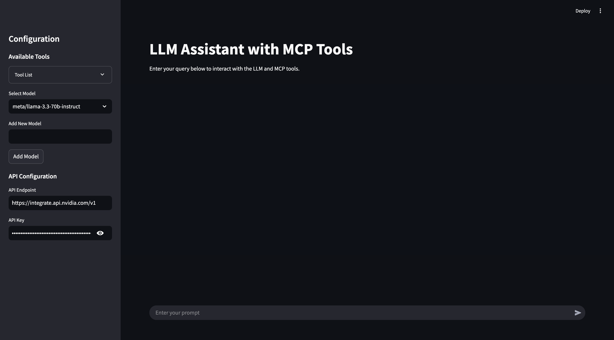

# Llama MCP Streamlit

This project is an interactive AI assistant built with **Streamlit**, **NVIDIA NIM's API (LLaMa 3.3:70b)/Ollama**, and **Model Control Protocol (MCP)**. It provides a conversational interface where you can interact with an LLM to execute real-time external tools via MCP, retrieve data, and perform actions seamlessly.

The assistant supports:

- **Custom model selection** (NVIDIA NIM / Ollama)
- **API configuration** for different backends
- **Tool integration via MCP** to enhance usability and real-time data processing
- **A user-friendly chat-based experience** with Streamlit

## 📸 Screenshots




---

## 📁 Project Structure

```
llama_mcp_streamlit/
│── ui/
│   ├── sidebar.py       # UI components for Streamlit sidebar
│   ├── chat_ui.py       # Chat interface components
│── utils/
│   ├── agent.py         # Handles interaction with LLM and tools
│   ├── mcp_client.py    # MCP client for connecting to external tools
│   ├── mcp_server.py    # Configuration for MCP server selection
│── config.py            # Configuration settings
│── main.py              # Entry point for the Streamlit app
.env                      # Environment variables
Dockerfile                # Docker configuration
pyproject.toml            # Poetry dependency management
```

---

## 🔧 Environment Variables

Before running the project, configure the `.env` file with your API keys:

```
# Endpoint for the NVIDIA Integrate API
API_ENDPOINT=https://integrate.api.nvidia.com/v1
API_KEY=your_api_key_here

# Endpoint for the Ollama API
API_ENDPOINT=http://localhost:11434/v1/
API_KEY=ollama
```

---

## 🚀 Running the Project

### Using Poetry

1. Install dependencies:
   ```bash
   poetry install
   ```
2. Run the Streamlit app:
   ```bash
   poetry run streamlit run llama_mcp_streamlit/main.py
   ```

### Using Docker

1. Build the Docker image:
   ```bash
   docker build -t llama-mcp-assistant .
   ```
2. Run the container:
   ```bash
   docker compose up
   ```

---


## 🔄 Changing MCP Server Configuration

To modify which MCP server to use, update the `utils/mcp_server.py` file.
You can use either NPX or Docker as the MCP server:

### NPX Server

```python
server_params = StdioServerParameters(
    command="npx",
    args=[
        "-y",
        "@modelcontextprotocol/server-filesystem",
        "/Users/username/Desktop",
        "/path/to/other/allowed/dir"
    ],
    env=None,
)
```

### Docker Server

```python
server_params = StdioServerParameters(
    command="docker",
    args=[
        "run",
        "-i",
        "--rm",
        "--mount", "type=bind,src=/Users/username/Desktop,dst=/projects/Desktop",
        "--mount", "type=bind,src=/path/to/other/allowed/dir,dst=/projects/other/allowed/dir,ro",
        "--mount", "type=bind,src=/path/to/file.txt,dst=/projects/path/to/file.txt",
        "mcp/filesystem",
        "/projects"
    ],
    env=None,
)
```

Modify the `server_params` configuration as needed to fit your setup.

---

## 📌 Features

- **Real-time tool execution via MCP**
- **LLM-powered chat interface**
- **Streamlit UI with interactive chat elements**
- **Support for multiple LLM backends (NVIDIA NIM & Ollama)**
- **Docker support for easy deployment**

---

## 🛠 Dependencies

- Python 3.11+
- Streamlit
- OpenAI API (for NVIDIA NIM integration)
- MCP (Model Control Protocol)
- Poetry (for dependency management)
- Docker (optional, for containerized deployment)

---

## 📜 License

This project is licensed under the MIT License.

---

## 🤝 Contributing

Feel free to submit pull requests or report issues!

---

## 📬 Contact

For any questions, reach out via GitHub Issues.

---
